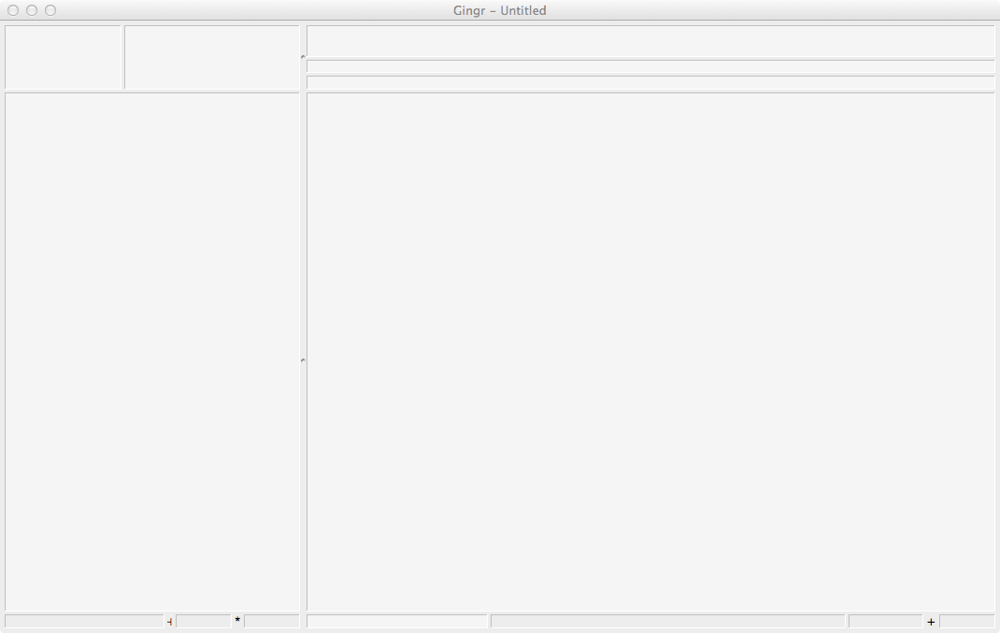
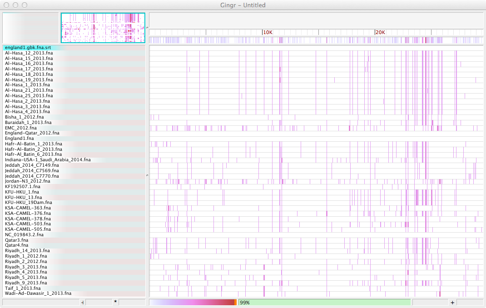
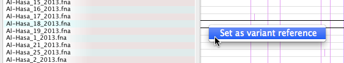
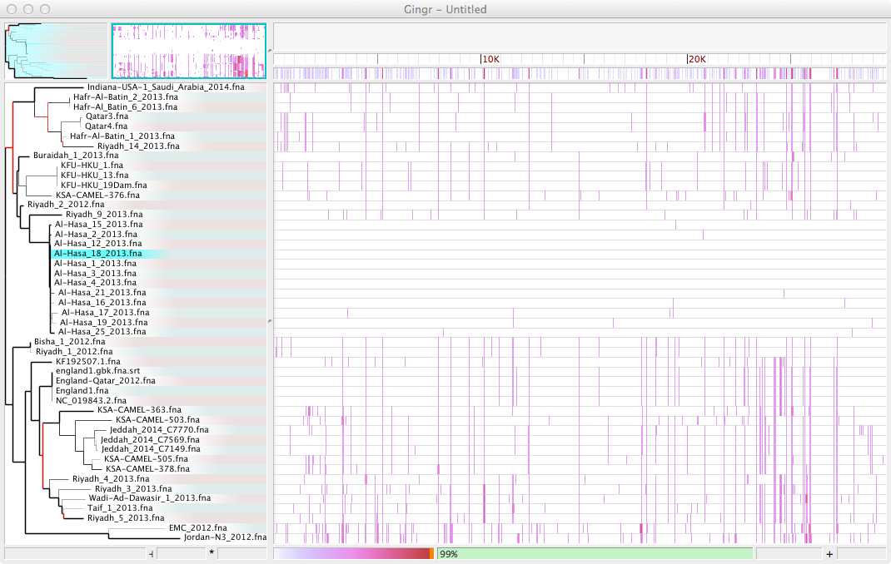
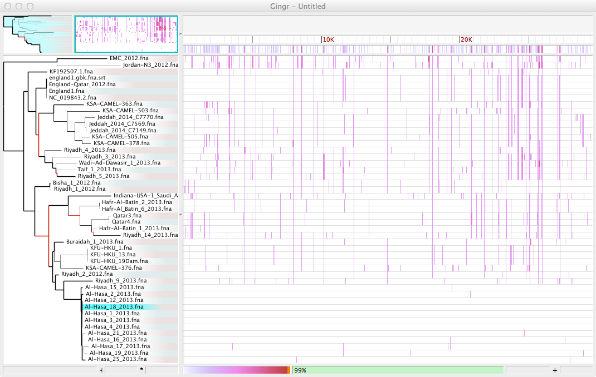
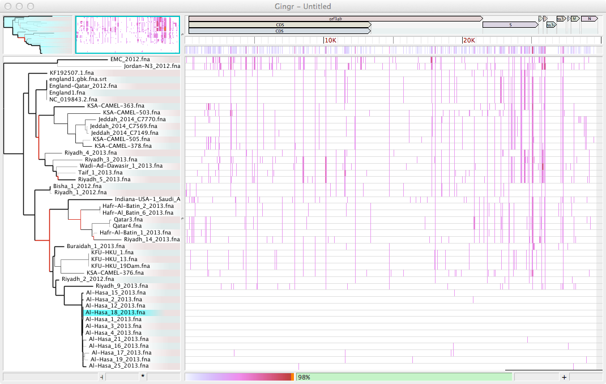

Importing other files
---------------------
* Create a new workspace (File->New)

* Download the data files

  * Alignment: :download:`xmfa <parsnp.xmfa>`
  * Reference: :download:`fasta <england1.fna>` 
  * Annotations: :download:`genbank <england1.gbk>` 
  * Phylogeny: :download:`newick <parsnp.tree>` 

* Open the XMFA alignment (File->Open). Since XMFA files can be accompanied by reference files, the Open dialog will appear. Choose the Fasta file as the reference in this window.

.. image:: open.png

* The preview panes allow you to ensure that the header for the reference is the same as the first sequence in the XMFA. This allows sequences between LCBs to be shown and allows annotations to be added later.

* The track highlighted in blue ("england.gbk.fna.srt") is the current reference for variants. Select a new reference by right-clicking on a track.

* Next, import the phylogenetic tree (File->Open)

* Reroot the tree at the midpoint (Tree->Reroot at midpoint)

.. image:: reroot.png

* The tree will now be balanced at the center of the longest path

* Finally, import the annotations (File->Open)

* The workspace can be saved to share or return to later (File->Save)
