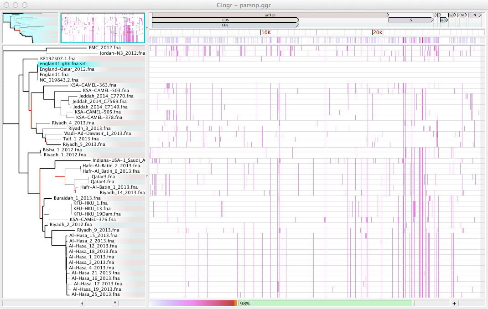
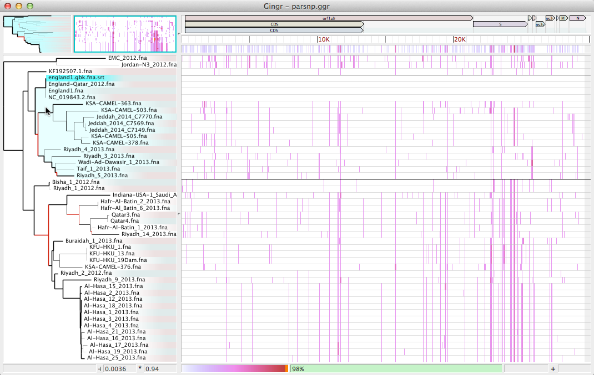
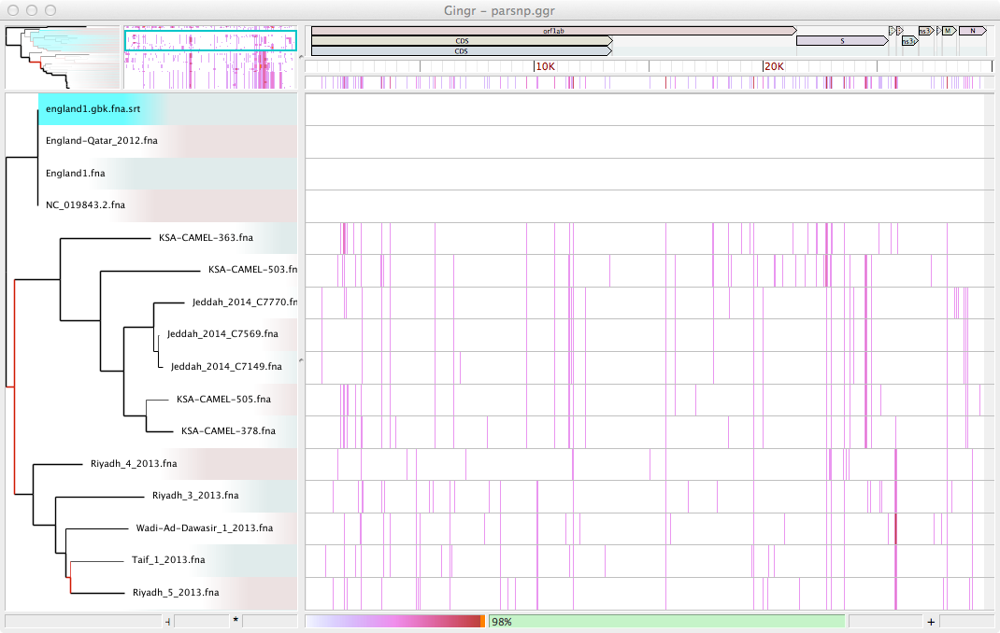
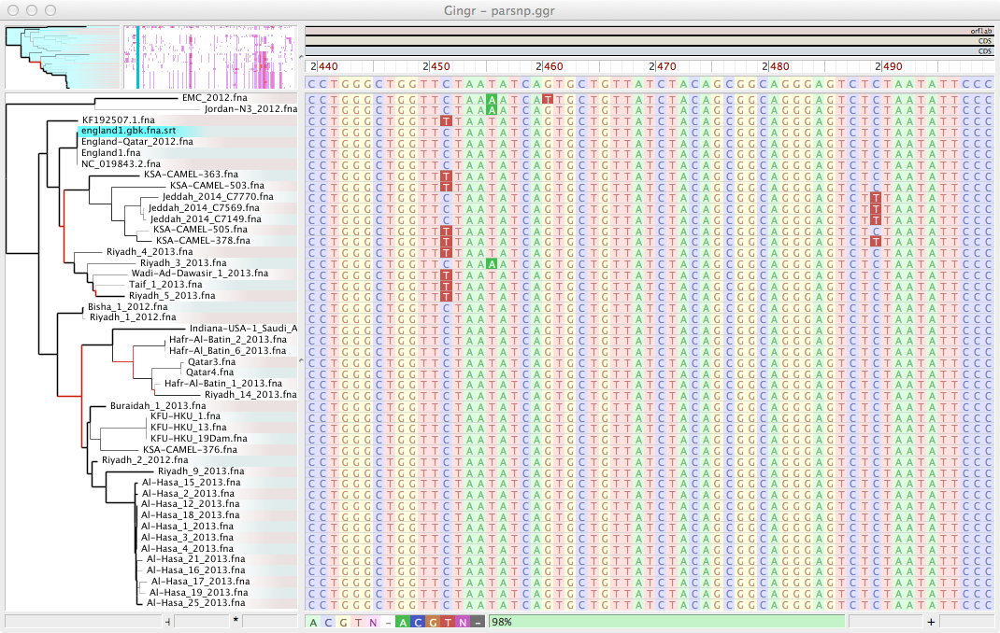

Quickstart
==========

Before you run
---------------

   1. To run Gingr OSX, you will need to right click to open and bypass the unsigned developer notice:
   
      * Future releases will be signed
   
   
Browsing a Gingr file
--------------------
* Download :download:`Gingr input file <parsnp.ggr>`

* Open in Gingr (File->Open)

* The phylogeny appears on the left. Hover over a clade to highlight and outline the corresponding tracks to the right.

* Click to zoom in on the clade

* The multiple alignment appears on the right, shown as a SNP heatmap when zoomed out. To see the full alignment, zoom in with the mouse wheel or by selecting a region in the ruler.

Importing other files
---------------------
* Create a new workspace (File->New)

.. image:: new.png

* Download the data files

  * Alignment: :download:`xmfa <parsnp.xmfa>`
  * Reference: :download:`fasta <england1.fna>` 
  * Annotations: :download:`genbank <england1.gbk>` 
  * Phylogeny: :download:`newick <parsnp.tree>` 

* Import the alignment with the refrence (File->Import Alignment (XMFA & Fasta))

.. image:: xmfa.png

* The track highlighted in blue ("england.gbk.fna.srt") is the current reference for variants. Select a new reference by right-clicking on a track.

.. image:: reref.png

* Next, import the phylogenetic tree (File->Import tree (Newick))

.. image:: tree.png

* Reroot the tree at the midpoint (Tree->Reroot at midpoint)

.. image:: reroot.png

* The tree will now be balanced at the center of the longest path

.. image:: rerooted.png

* Finally, import the annotations (File->Import annotations (Genbank))

.. image:: annotated.png

* The workspace can be saved to share or return to later (File->Save)
