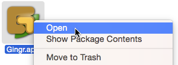

Running Gingr
-------------

Mac OS X
""""""""
* Gingr.app can be moved to the Applications folder if desired
* Double-click Gingr.app to run
* Depending on your security settings, there may be an error that Gingr is not from the Mac App Store or is from an unidentified developer. To run it anyway:
 * Right click on Gingr.app
 * Select "Open" from the menu
 * Click the "Open" button at the next prompt

|img_open|

Linux
"""""
* From the desktop
 * Click on the "gingr" binary
* From a terminal
 * Navigate to the folder with the "gingr" binary
 * Run "./gingr"

