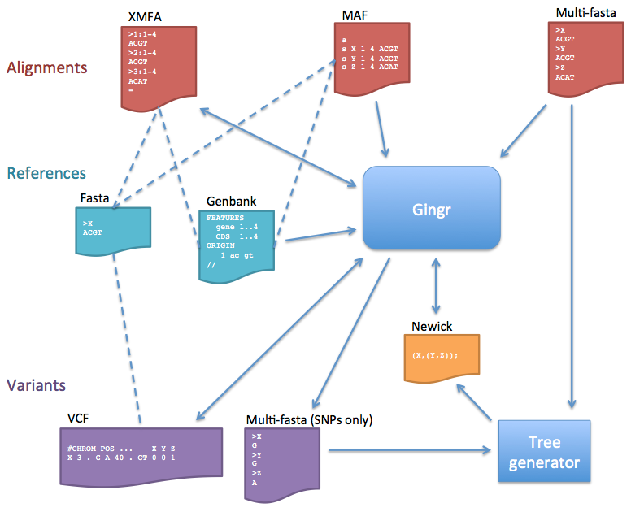

File formats
============

The flowchart below describes the various file formats that can be imported or
exported to/from Gingr (or the `harvesttools` command line utility).

* Alignments
	* Core only: The Gingr file format stores core alignments, or alignments that involve all genomes. When alignments are loaded, blocks that are not core will be discarded.
	* When importing MAF alignments, the first sequence of the first core block is used as the reference. Each reference contig will be padded with Ns up to its first LCB and between subsequent LCBs. If alignment blocks overlap in reference coordinate space, the block seen earlier in the file will be kept; the later one will be ignored.
	* Multi-fasta: This format does not store rearrangement information, so the alignment is treated as a single LCB.
* References
	* XMFA files can be accompanied by Fasta reference files to provide sequence between LCBs and to allow Genbank annotations (which must have matching GI numbers) to be loaded later. Genbank files that contain sequence can also be used as references.
	* Multi-fasta alignments will use the first sequence as the reference. Genbank annotations can be loaded later if the GIs match.
* Variants
	* VCF files must be imported with a Fasta reference. The only fields imported are sequence identifier (CHROM), position (POS), reference allele (REF), alternate alleles (ALT), quality (QUAL), filters (FILTER, including ##FILTER specifications in the header), and genotype (GT); all other information is ignored. Additionally, Since VCF does not store complete alignment information, any insertions larger than one base will be replaced by an LCB boundary when importing. If a genotype is diploid or polyploid, only the first haplotype is used in the multi-alignment (the others are ignored). Symbolic alleles and breakends are currently unsupported and will also be ignored. When writing to VCF, only the imported fields will be populated. Indel output is also currently unimplemented, so indels will be skipped when writing.
	* The multi-fasta SNP output is the same format as multi-fasta alignments, but only contains columns with unfiltered ("PASS") variants (like a Mauve SNP file). This is useful for generating phylogenetic trees, but does not contain positional information or rearrangements.
