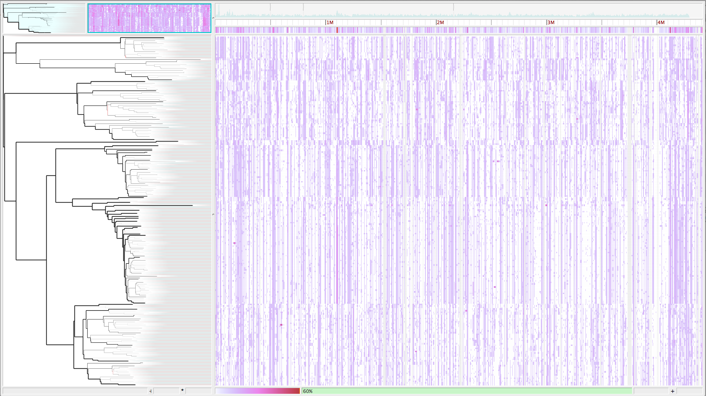

.. harvest documentation master file, created by
   sphinx-quickstart on Wed Jul  9 13:23:37 2014.
   You can adapt this file completely to your liking, but it should at least
   contain the root `toctree` directive.

=================================================================
Harvest software suite for rapid genome alignment and visualization 
=================================================================

Project home page: https://github.com/marbl/harvest

==============
Release status
==============

07/21/14: `v1.0`

=================
Overview
=================

Harvest is a suite of core-genome alignment and visualization tools
for quickly analyzing thousands of intraspecific microbial
genomes. Harvest includes Parsnp, a fast core-genome multi-aligner, harvest-tools, a binary archive format and format conversion tool,
and Gingr, a dynamic visual platform. Combined they provide
rapid core-genome alignments, variant calls, recombination
detection, and phylogenetic trees.  

Contents:

.. toctree::
   :maxdepth: 3

   content/hardware
   content/installation
   content/gingr
   content/harvest-tools
   content/parsnp
   content/faq

