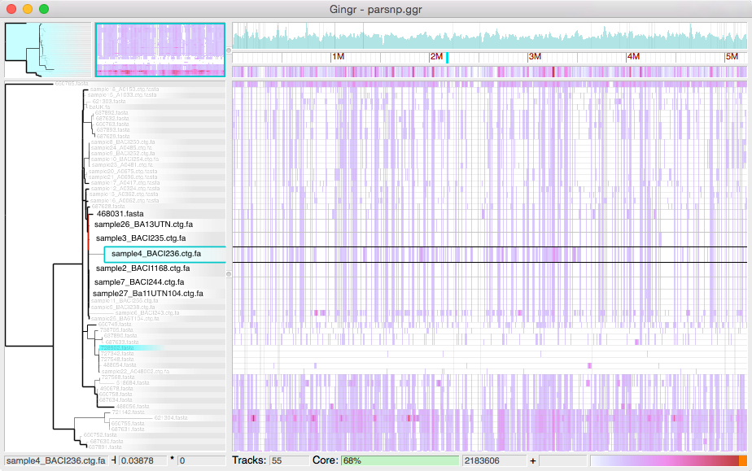

.. harvest documentation master file, created by
   sphinx-quickstart on Wed Jul  9 13:23:37 2014.
   You can adapt this file completely to your liking, but it should at least
   contain the root `toctree` directive.

Harvest
=======

Harvest is a suite of core-genome alignment and visualization tools
for quickly analyzing thousands of intraspecific microbial
genomes, including variant calls, recombination
detection, and phylogenetic trees.  

**Tools**

* `Parsnp <content/parsnp.html>`_ - Core-genome alignment and analysis
* `Gingr <content/gingr.html>`_ - Interactive visualization of alignments, trees and variants
* `HarvestTools <content/harvest-tools.html>`_ - Archiving and postprocessing

**Citation (preprint)**

   Treangen TJ, Ondov BD, Koren S, Phillippy AM.
   "Rapid Core-Genome Alignment and Visualization for Thousands of Microbial Genomes."
   *bioRxiv* (2014). doi: http://dx.doi.org/10.1101/007351

**Download (v1.1, 6-Feb-2015)**

* `Harvest-OSX64-v1.1.tar.gz <https://github.com/marbl/harvest/releases/download/v1.1/Harvest-OSX64-v1.1.tar.gz>`_
* `Harvest-Linux64-v1.1.tar.gz <https://github.com/marbl/harvest/releases/download/v1.1/Harvest-Linux64-v1.1.tar.gz>`_

.. toctree::
   :hidden:

   content/gingr
   content/parsnp
   content/harvest-tools

