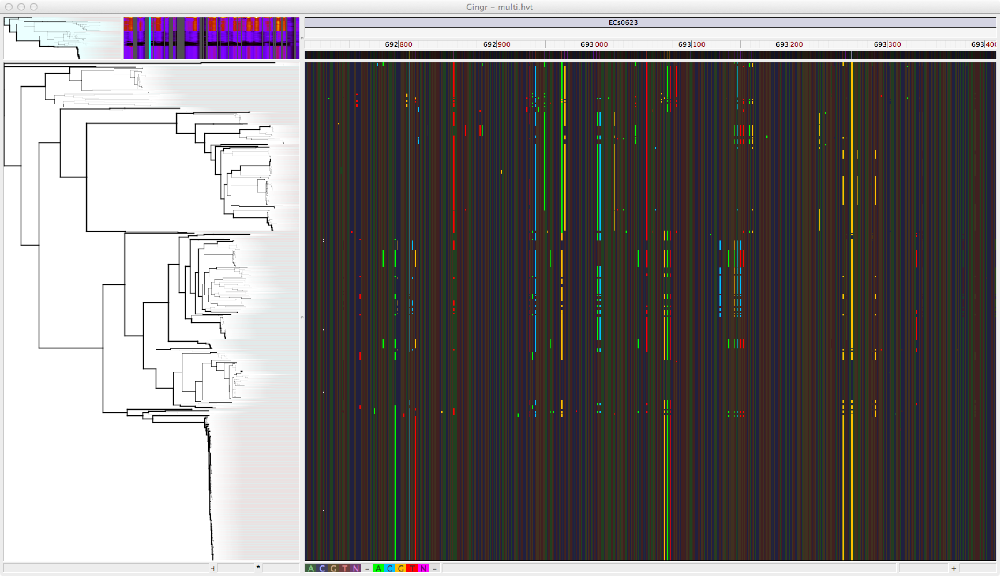

.. harvest documentation master file, created by
   sphinx-quickstart on Wed Jul  9 13:23:37 2014.
   You can adapt this file completely to your liking, but it should at least
   contain the root `toctree` directive.

=================================================================
Harvest software suite for rapid genome alignment and visualization
=================================================================

=================
Overview
=================

FIXME

=================
Citation
=================
Submitted for review

Contents:

.. toctree::
   :maxdepth: 2

   content/hardware
   content/installation
   content/gingr
   content/harvest-tools
   content/parsnp
   content/faq

Indices and tables
==================

* :ref:`genindex`
* :ref:`modindex`
* :ref:`search`

